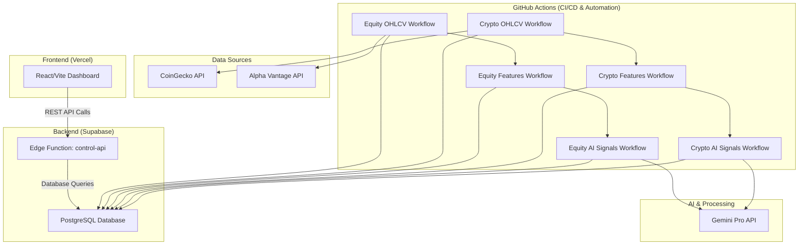

# Stratos Brain: Comprehensive Codebase and System Review

**Author:** Manus AI
**Date:** January 9, 2026

## 1. Introduction

This document provides a comprehensive review of the Stratos Brain project, a sophisticated financial analysis platform designed to identify high-probability trading setups in cryptocurrency and equity markets. The review covers the full technology stack, including the backend data pipelines, the Supabase database architecture, the frontend React application, and the automated workflows that tie the system together. The objective is to create a deep, shared understanding of the system's current state to facilitate future development and ideation.

## 2. System Architecture Overview

The Stratos Brain platform is built on a modern, decoupled architecture that separates data processing from the user-facing application. This design enhances scalability, maintainability, and security.

**The key components are:**

1.  **Data Pipelines**: Automated GitHub Actions workflows that ingest, process, and analyze market data daily.
2.  **Supabase Backend**: A PostgreSQL database for all data storage, coupled with an Edge Function (`control-api`) that serves as a secure REST API gateway for the frontend.
3.  **Frontend Dashboard**: A React application built with Vite and hosted on Vercel, providing users with interactive data tables, charts, and AI-driven insights.

## 3. Database Schema

The project's data layer is a well-structured PostgreSQL database hosted on Supabase. Migrations are managed in the `supabase/migrations` directory, providing a clear history of the schema. The database effectively separates raw data, calculated features, and user-generated content.

### Key Data Tables

| Table Name | Description | Key Columns |
| :--- | :--- | :--- |
| `assets` | Master list of all tracked assets (equities and crypto). | `asset_id`, `symbol`, `asset_type`, `coingecko_id` |
| `daily_bars` | Raw daily OHLCV (Open, High, Low, Close, Volume) data. | `asset_id`, `date`, `open`, `high`, `low`, `close`, `volume` |
| `daily_features` | ~30 calculated technical indicators for each asset. | `asset_id`, `date`, `rsi_14`, `ma_dist_50`, `trend_regime` |
| `asset_ai_reviews` | Stores the output of the AI analysis, including scores and rationale. | `asset_id`, `as_of_date`, `ai_direction_score`, `ai_setup_quality_score` |
| `equity_fundamentals` | Stores quarterly and annual financial statement data for equities. | `asset_id`, `fiscal_date_ending`, `total_revenue`, `net_income`, `eps` |
| `company_chats` | Manages persistent chat sessions for each company/asset. | `chat_id`, `asset_id`, `system_prompt`, `last_message_at` |
| `chat_messages` | Stores the history of messages, including user, assistant, and tool interactions. | `message_id`, `chat_id`, `role`, `content`, `tool_calls` |
| `core_portfolio_holdings`| Tracks user's real portfolio holdings with quantity and cost basis. | `asset_id`, `quantity`, `cost_basis`, `total_cost` |
| `watchlist` / `stock_lists` | Manages user-created lists of assets. | `user_id`, `asset_id`, `list_id` |

### Database Views & Functions

The schema is augmented by numerous views (e.g., `v_dashboard_all_assets`, `v_active_signals`, `v_core_portfolio_holdings`) that denormalize and aggregate data for efficient retrieval by the frontend. The system also uses `pgmq` for queuing background jobs, as seen in `src/stratos_engine/db.py`.

## 4. Backend and Data Workflows

The core logic resides in the Python data pipeline (`src/stratos_engine`) and the automated GitHub Actions workflows (`.github/workflows`).

### Automated Daily Pipelines

Two parallel pipelines, one for crypto and one for equities, run daily. They are orchestrated using `workflow_run` triggers in GitHub Actions, ensuring sequential execution.

1.  **Stage 1: OHLCV Ingestion**
    *   **Scripts**: `jobs/crypto_daily_ohlcv.py`, `jobs/equity_daily_ohlcv.py`
    *   **Process**: Fetches daily price and volume data from CoinGecko (for crypto) and Alpha Vantage (for equities). The data is then saved to the `daily_bars` table.
    *   **Schedule**: Crypto runs daily at 00:30 UTC; Equity runs on trading days at 21:30 UTC.

2.  **Stage 2: Feature Calculation**
    *   **Scripts**: `jobs/crypto_daily_features.py`, `jobs/equity_daily_features.py`
    *   **Process**: Triggered by the completion of Stage 1. This stage calculates over 30 technical indicators (e.g., RSI, MACD, Moving Averages, Volatility) from the raw bar data and saves them to the `daily_features` table.

3.  **Stage 3: AI Signal Generation**
    *   **Scripts**: `run_all_crypto.py`, `run_all_equities.py`
    *   **Process**: Triggered by the completion of Stage 2. This is the core AI analysis step. It selects the top 500 assets by volume and, for each one, constructs a detailed prompt for the Gemini Pro API. The prompt includes historical OHLCV data and the calculated features. The AI returns a structured JSON object containing a directional score, a setup quality score, a detailed rationale, and key price levels, which are then saved to the `asset_ai_reviews` table.

### API Layer: Supabase Edge Function

The `control-api` Edge Function (`supabase/functions/control-api/index.ts`) acts as the primary backend for the frontend dashboard. It's an Express-like server running on Deno that exposes a REST API.

*   **Authentication**: It validates requests using either a Supabase JWT or a shared secret API key (`x-stratos-key`), making it secure for both user sessions and programmatic access.
*   **Routing**: It provides numerous endpoints for all frontend needs, including:
    *   Fetching aggregated dashboard data (e.g., `/dashboard/all-assets`, `/dashboard/watchlist`).
    *   CRUD operations for user-specific data (notes, watchlists, stock lists, portfolio holdings).
    *   Proxying requests to the Gemini API for the Company Chat feature (`/dashboard/chat`).
    *   Generating documents like one-pagers and memos (`/dashboard/create-document`).

## 5. Frontend Architecture

The frontend is a modern React single-page application (SPA) located in the `dashboard/` directory. It is built with Vite, TypeScript, and styled with Tailwind CSS and Shadcn/UI components.

*   **Routing**: The application uses the `wouter` library for client-side routing, as defined in `client/src/App.tsx`. It supports various views, including the main dashboard, individual asset detail pages, and administrative pages.
*   **Main Views**:
    *   `Home.tsx`: The central page that dynamically renders different data tables (`CustomizableAssetTable`, `CustomizableWatchlistTable`, etc.) based on the selected tab.
    *   `DashboardLayout.tsx`: The main layout component that provides the navigation sidebar, header, and status information.
    *   `AssetDetail.tsx`: A modal view that displays in-depth information for a single asset, including charts, AI reviews, and fundamental data.
*   **Data Fetching**: Data is fetched from the `control-api` using the `useSWR` hook, which provides caching, revalidation, and a reactive data flow.
*   **Company Chat**: A key feature (`pages/CompanyChat.tsx`) that provides a dedicated, persistent chat interface for each asset. It leverages the `company-chat-api` to interact with Gemini, enabling natural language queries about company data, news, and analysis. The architecture supports native Gemini tool use, including code execution, web search, and custom function calls to the Stratos Brain database.

## 6. Summary and Conclusion

The Stratos Brain project is a robust and well-architected platform that effectively combines automated data pipelines, AI analysis, and an interactive user interface. The separation of concerns between the data processing backend, the API layer, and the frontend application is a significant strength, allowing for independent development and scaling.

The system is designed for extensibility, as demonstrated by the recent additions of the company chat and detailed portfolio tracking features. The documentation is thorough, providing a clear understanding of the system's logic and workflows.

I have now completed the comprehensive review and have a deep understanding of the project's database, backend, frontend, and workflows. I am ready to discuss your ideas and help with the next phase of development.
