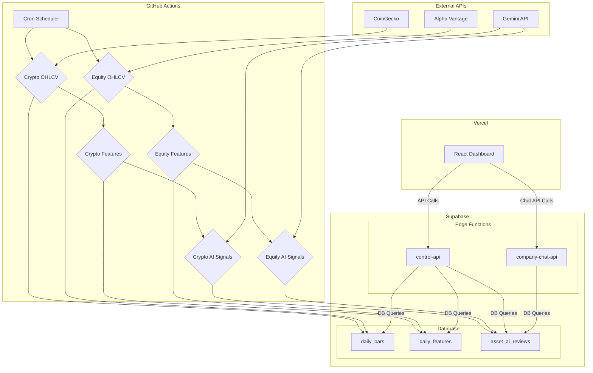

# Stratos Brain Codebase: A Comprehensive Review

**Author:** Manus AI
**Date:** January 9, 2026

## 1. Introduction

This document provides a comprehensive review of the Stratos Brain project, a sophisticated financial analysis platform. The review covers the full codebase, including the database schema, Supabase integration, backend data processing pipeline, frontend application, Vercel deployment, and automation workflows. The goal is to establish a thorough understanding of the system to facilitate future development and support requests.

## 2. System Architecture Overview

The Stratos Brain platform is designed with a modern, decoupled architecture. It consists of several key components that work together to ingest, analyze, and present financial market data.

- **Data Ingestion**: Automated jobs fetch daily market data for cryptocurrencies and equities from external APIs (CoinGecko and Alpha Vantage).
- **Backend Processing**: A Python-based data processing pipeline, orchestrated by a worker, calculates a vast array of technical indicators and generates AI-powered trading signals.
- **Database**: A PostgreSQL database hosted on Supabase serves as the central data store for all market data, calculated features, and AI-generated insights.
- **API Layer**: Supabase Edge Functions provide a RESTful API for the frontend to interact with the database securely.
- **Frontend**: A React-based single-page application (SPA) provides a rich, interactive dashboard for users to explore the data and analysis.
- **Automation**: GitHub Actions are used to schedule and execute the daily data ingestion and processing workflows.

## 3. Database Schema and Supabase Integration

The project leverages a Supabase-hosted PostgreSQL database, which is well-structured and organized. The database schema is defined through a series of migration files located in `supabase/migrations/`.

### Key Tables

| Table Name | Description |
|---|---|
| `assets` | Master list of all tracked assets (crypto and equity). |
| `daily_bars` | Stores daily OHLCV (Open, High, Low, Close, Volume) price data. |
| `daily_features` | Contains a wide range of calculated technical indicators. |
| `asset_ai_reviews` | Stores AI-generated analysis and scores for assets. |
| `company_chats` | Manages company-specific AI chat sessions. |
| `chat_messages` | Stores all messages within a chat session. |
| `engine_jobs` | A queue for jobs to be processed by the backend worker. |

### Supabase Edge Functions

Supabase Edge Functions, written in TypeScript, serve as the API backend. They are located in the `supabase/functions/` directory.

- **`control-api`**: This is the main API for the dashboard, providing endpoints for fetching data, managing watchlists, and more. It acts as a secure gateway to the database.
- **`company-chat-api`**: This function powers the company-specific chat feature, integrating with the Gemini API for conversational AI and providing a unified interface for function calling (including database access, web search, and code execution).

## 4. Backend Data Processing Pipeline

The core of the data processing is a Python application found in `src/stratos_engine/`. A `worker.py` script continuously polls a job queue (`engine_jobs` table) and processes jobs in a staged pipeline.

### Pipeline Stages

The processing is broken down into several distinct stages, each implemented as a Python class in the `src/stratos_engine/stages/` directory:

- **Stage 1 (Fetch & Evaluate)**: Ingests raw data and evaluates signal templates.
- **Stage 2 (AI Analysis)**: Uses the Gemini API to perform an initial AI analysis of assets.
- **Stage 3 (State Machine)**: Manages the state of signal instances (e.g., new, active, expired).
- **Stage 4 (Scoring)**: Calculates various scores for assets based on the generated signals and features.
- **Stage 5 (AI Review)**: Performs a more in-depth AI review of the top-scoring assets.

## 5. Frontend Application and Vercel Deployment

The frontend is a modern React application built with Vite, TypeScript, and Tailwind CSS. The source code is located in `dashboard/client/`.

### Key Features

- **Routing**: The application uses `wouter` for client-side routing, with routes defined in `src/App.tsx`.
- **UI Components**: A rich set of UI components is built using `shadcn/ui` and Radix UI primitives.
- **State Management**: `SWR` is used for data fetching and caching, providing a responsive user experience.
- **Deployment**: The application is deployed on Vercel. The `vercel.json` file configures the build process and defines rewrite rules to proxy API requests to the Supabase Edge Functions.

## 6. Automation and Workflows

Daily data processing tasks are automated using GitHub Actions. The workflow files are located in `.github/workflows/`.

There are two parallel sets of workflows, one for cryptocurrency and one for equities. Each set consists of three sequential jobs:

1.  **OHLCV Ingestion**: Fetches daily price data.
2.  **Features Calculation**: Calculates technical indicators.
3.  **AI Signal Generation**: Generates AI-powered trading signals.

These workflows are scheduled to run daily and ensure that the data in the platform is always up-to-date.

## 7. Key Technologies and Dependencies

| Category | Technology/Library |
|---|---|
| **Frontend** | React, TypeScript, Vite, Tailwind CSS, shadcn/ui, wouter, SWR |
| **Backend** | Python, psycopg2, aiohttp, structlog |
| **Database** | PostgreSQL, Supabase, pg_cron, pgmq |
| **API** | Deno, TypeScript, Express.js (in `dashboard/server`) |
| **AI** | Google Gemini API |
| **Deployment** | Vercel, Docker |
| **Automation** | GitHub Actions |

## 8. Summary and Next Steps

The Stratos Brain project is a well-architected and comprehensive financial analysis platform. The codebase is clean, well-organized, and makes use of modern technologies and best practices. The decoupled architecture allows for scalability and maintainability.

With this comprehensive review complete, I am now fully equipped to assist with any questions or requests you may have regarding the Stratos Brain codebase.
