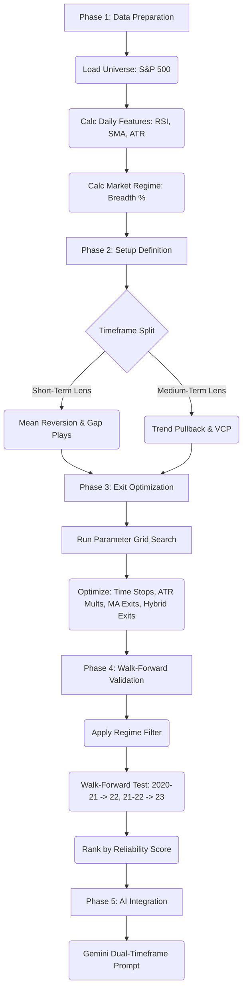

# Stratos Brain Backtesting Methodology (V2)

**Author:** Manus AI
**Date:** January 25, 2026

## 1. Executive Summary

This document outlines the definitive backtesting and optimization methodology for the Stratos Brain platform. Our core objective is to **identify and validate high-probability trading setups** by systematically testing entry conditions and optimizing exit strategies across multiple timeframes. The system is designed from the ground up to be **auditable, modular, and robust** enough to survive contact with live markets.

Our key finding is that a **one-size-fits-all approach does not work**. Different trading ideas require different holding periods and exit logic. Therefore, we have designed a **dual-timeframe architecture** that separates strategies into two distinct "lenses":

1.  **Short-Term Lens (1-4 weeks):** Focuses on mean reversion and momentum plays with tight stops and quick exits.
2.  **Medium-Term Lens (1-6 months):** Focuses on trend following and relative strength with wider stops and patient holds.

This V2 of the methodology incorporates critical feedback on transaction costs, hybrid exits, and walk-forward optimization to ensure the system is not just theoretically profitable, but practically viable.

## 2. Core Principles

The entire system is built on these foundational principles:

| Principle | Description |
|---|---|
| **Setup-Specific Exits** | Exit logic MUST match the entry thesis. A mean reversion trade should not have a trend-following exit. |
| **Dual Timeframe** | Strategies are explicitly categorized as either short-term or medium-term, with appropriate parameters for each. |
| **Optimization is Key** | We do not assume parameters. Both entry and exit parameters are systematically optimized through grid search. |
| **Friction & Slippage** | All backtests deduct a **0.1% friction parameter** from every trade to simulate real-world transaction costs. |
| **Walk-Forward Validation** | We use walk-forward optimization, not a single out-of-sample test, to ensure robustness across different market regimes. |
| **Asset-Specific Grids** | We use separate optimization grids for Equities and Crypto to account for different volatility profiles. |
| **Auditability** | Every trade is logged with the exact conditions that triggered entry and exit, ensuring full transparency. |

## 3. The Backtesting Workflow

The process follows a systematic 5-phase approach:

### Phase 1: Data Preparation

1.  **Universe Selection:** We use a universe of the S&P 500 components, filtered for liquidity and data availability.
2.  **Feature Calculation:** All technical indicators (MAs, RSI, ATR, etc.) are pre-calculated and stored in the `daily_features` table.
3.  **Market Regime:** Market breadth (% of stocks above 200 MA) is calculated daily to serve as a regime filter.

### Phase 2: Setup Definition

1.  **Entry Logic:** Each setup is defined by a clear, non-discretionary set of entry conditions.
2.  **Timeframe Categorization:** Each setup is assigned to either the **Short-Term** or **Medium-Term** lens.
3.  **Exit Parameter Grid:** For each category and asset class (Equity vs. Crypto), we define a grid of possible exit parameters to be tested.

### Phase 3: Parameter Optimization

This is the most critical phase. For each setup, we perform a **grid search** to test every possible combination of its exit parameters.

-   **Friction Test:** A **0.1% friction parameter** is deducted from every trade to simulate slippage and commissions.
-   **Hybrid Exit Optimization:** The grid search explicitly tests a `position_scaling` variable, comparing a 100% exit vs. a 50/50 "free-roll" exit.

### Phase 4: Walk-Forward Validation

To avoid over-optimization, we use **Walk-Forward Validation** instead of a single out-of-sample test.

1.  **Optimize on 2020-2021 data**, then test the best parameters on **2022 data**.
2.  **Optimize on 2021-2022 data**, then test the best parameters on **2023 data**.
3.  **Optimize on 2022-2023 data**, then test the best parameters on **2024 data**.

A setup is only considered robust if it remains profitable and stable across all walk-forward periods.

### Phase 5: AI Integration

Once a setup is validated through walk-forward testing, its logic is integrated into the Stratos Brain AI scoring system.

-   The AI is trained to recognize the setup and provide a **dual-timeframe thesis**:
    -   **Short-Term Thesis:** What to expect in the next 1-4 weeks.
    -   **Medium-Term Thesis:** The outlook for the next 1-6 months.

## 4. System Architecture

The system is designed as a modular Python application:

-   `walk_forward_optimizer.py`: The core engine that runs the walk-forward optimization.
-   `config/setups.py`: A central file defining all setup entry conditions.
-   `config/exit_grids.py`: A file defining the parameter grids for optimization, with separate sections for Equity and Crypto.
-   `data/`: Directory where all results (JSON, CSV) are stored for analysis.

## 5. Conclusion

This V2 methodology provides a robust and systematic framework for identifying and validating profitable trading strategies. By incorporating friction simulation, hybrid exit optimization, and walk-forward validation, we can build a system that is not just theoretically profitable, but has a high probability of performing well in live markets.
