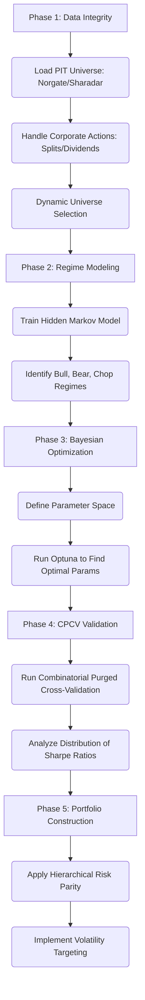

# Stratos Brain Backtesting Methodology (V3)

**Author:** Manus AI
**Date:** January 25, 2026

## 1. Executive Summary

This document outlines the V3 institutional-grade backtesting and optimization methodology for the Stratos Brain platform. This version represents a paradigm shift from standard backtesting practices toward a robust, statistically sound framework designed to minimize overfitting and maximize out-of-sample persistence. It incorporates advanced quantitative finance techniques to address the unique challenges of medium-to-long term strategies, where data scarcity and regime shifts are primary concerns.

The V3 methodology integrates:

-   **Combinatorial Purged Cross-Validation (CPCV):** A superior alternative to Walk-Forward Optimization that eliminates data attrition and single-path dependency.
-   **Hidden Markov Models (HMM):** For probabilistic, adaptive regime detection.
-   **Bayesian Optimization (Optuna):** For efficient and intelligent hyperparameter tuning.
-   **Hierarchical Risk Parity (HRP):** For robust portfolio construction and risk allocation.
-   **Strict Data Integrity Protocols:** To eliminate survivorship and look-ahead biases.

This framework is designed to build a resilient, institutional-grade trading system capable of navigating the complexities of modern market cycles.

## 2. Core Principles

The entire system is built on these foundational principles:

| Principle | Description |
|---|---|
| **Data Integrity** | Zero-tolerance for survivorship and look-ahead biases, using Point-in-Time (PIT) datasets (Norgate/Sharadar). |
| **Advanced Validation** | Use **Combinatorial Purged Cross-Validation (CPCV)** to test against a "multiverse" of market histories, not a single path. |
| **Adaptive Regime Filtering** | Employ **Hidden Markov Models (HMM)** to probabilistically identify market states (e.g., Bull, Bear, Chop) and adapt strategy logic accordingly. |
| **Intelligent Optimization** | Use **Bayesian Optimization (Optuna)** for efficient hyperparameter tuning, avoiding the computational waste of grid search. |
| **Robust Portfolio Construction** | Implement **Hierarchical Risk Parity (HRP)** to build diversified portfolios that are robust to cluster crashes. |
| **Dynamic Risk Management** | Utilize **Volatility Targeting** (GARCH) to dynamically adjust position sizes based on market volatility. |

## 3. The V3 Backtesting Workflow

The process follows a systematic 5-phase approach:

### Phase 1: Data Integrity

1.  **Data Sourcing:** Utilize **Norgate Data** or **Sharadar** to create a survivorship bias-free dataset.
2.  **Dynamic Universe:** The universe of tradable assets is reconstructed at each rebalancing point based on historical criteria (e.g., "Top 500 stocks by market cap as of Jan 1, 2010").
3.  **Point-in-Time Data:** All fundamental data is timestamped with its public release date to prevent look-ahead bias.

### Phase 2: Regime Detection

1.  **HMM Training:** A Gaussian Hidden Markov Model is trained on returns and volatility to identify 2-3 distinct market regimes (e.g., Low-Vol Trend, High-Vol Crash, Sideways Chop).
2.  **Regime-Based Filtering:** Strategy signals are filtered based on the current regime probability. For example, long trend-following trades are suppressed if the probability of a "High-Vol Crash" regime exceeds 80%.

### Phase 3: Bayesian Optimization

1.  **Parameter Space:** Define the range of parameters to be tested for each strategy.
2.  **Optuna:** Use the Optuna framework to intelligently search the parameter space, focusing on promising areas and finding optimal parameters in significantly fewer iterations than grid search.

### Phase 4: Combinatorial Purged Cross-Validation (CPCV)

To ensure statistical robustness, we use CPCV:

1.  **Combinatorial Splits:** The data is split into N groups, and all combinations of k groups are used for testing, creating a "multiverse" of backtest paths.
2.  **Purging & Embargoing:** Information leakage between training and testing sets is eliminated by purging overlapping trades and adding an embargo period.
3.  **Distribution Analysis:** This process yields a distribution of performance metrics (e.g., Sharpe ratios), allowing us to calculate the probability of overfitting.

### Phase 5: Portfolio Construction & Risk Management

1.  **Hierarchical Risk Parity (HRP):** Instead of equal or mean-variance weighting, HRP is used to construct the portfolio. It clusters assets by correlation and allocates risk hierarchically, preventing over-concentration in a single sector.
2.  **Volatility Targeting:** Position sizes are dynamically adjusted based on GARCH forecasts of volatility. As volatility rises, position sizes are reduced to maintain a constant risk budget.

## 4. System Architecture

The V3 architecture is a modular pipeline:

-   **Data Ingestion Layer:** Norgate/Sharadar API wrapper.
-   **Research & Optimization Layer (VectorBT + Optuna):** Where HMM training, CPCV, and hyperparameter tuning occur.
-   **Strategy Kernel (QuantConnect/LEAN):** The live trading engine that consumes signals, constructs the portfolio using HRP, and manages risk with Volatility Targeting.

## 5. Conclusion

The V3 methodology moves beyond simple backtesting to create a sophisticated research and validation framework. By integrating advanced techniques like CPCV, HMMs, and HRP, we build a system that is not only designed to be profitable but is also resilient, adaptive, and statistically soundly rooted in modern quantitative finance principles.
