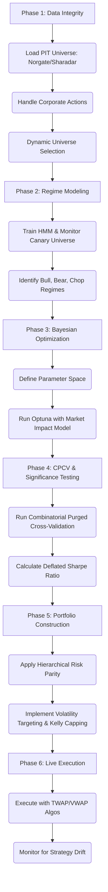

# Stratos Brain Backtesting Methodology (V4)

**Author:** Manus AI
**Date:** January 25, 2026

## 1. Executive Summary

This document outlines the V4 state-of-the-art backtesting and optimization methodology for the Stratos Brain platform. This version moves beyond the V3 framework by incorporating advanced techniques to address execution reality, statistical significance, and live performance monitoring. The goal is to create a system that is not only robust in backtesting but is also resilient and adaptive in live trading environments.

The V4 methodology integrates:

-   **Dynamic Market Impact Modeling:** Replacing flat fees with a slippage model based on the "Square Root Law."
-   **Deflated Sharpe Ratio (DSR):** To account for the multiple testing problem inherent in hyperparameter optimization.
-   **"Canary" Universes:** For faster, exogenous regime detection.
-   **Fractional Kelly Capping:** As a sanity check on leverage and position sizing.
-   **Live Drift Monitoring:** To automatically quarantine strategies that deviate from their backtested performance.

This framework represents a complete, institutional-grade pipeline from research to live execution.

## 2. Core Principles

The V4 system is built on these foundational principles:

| Principle | Description |
|---|---|
| **Data Integrity** | Zero-tolerance for survivorship and look-ahead biases, using Point-in-Time (PIT) datasets (Norgate/Sharadar). |
| **Advanced Validation** | Use **Combinatorial Purged Cross-Validation (CPCV)** to test against a "multiverse" of market histories. |
| **Statistical Significance** | Use the **Deflated Sharpe Ratio (DSR)** to ensure backtest results are not statistical flukes. |
| **Intelligent Optimization** | Use **Bayesian Optimization (Optuna)** for efficient hyperparameter tuning. |
| **Robust Portfolio Construction** | Implement **Hierarchical Risk Parity (HRP)** to build diversified portfolios that are robust to cluster crashes. |
| **Dynamic Risk Management** | Utilize **Volatility Targeting** (GARCH) and **Fractional Kelly Capping** to manage risk. |
| **Execution Reality** | Model **Market Impact** using the Square Root Law to simulate real-world trading costs. |
| **Live Monitoring** | Continuously monitor for **Strategy Drift** and automatically quarantine underperforming models. |

## 3. The V4 Backtesting Workflow

The process follows a systematic 6-phase approach:

### Phase 1-2: Data Integrity & Regime Modeling
(As per V3, with the addition of "Canary" universes for faster regime detection).

### Phase 3: Bayesian Optimization with Market Impact

-   **Dynamic Slippage Model:** The Optuna optimizer's objective function is modified to include a dynamic slippage model based on the **Square Root Law of Market Impact**. This penalizes strategies that trade illiquid assets, ensuring we optimize for real-world net returns.

### Phase 4: CPCV & Significance Testing

-   **Deflated Sharpe Ratio (DSR):** After CPCV, we calculate the DSR for the best strategy found. The DSR adjusts the Sharpe Ratio downwards based on the number of trials run by Optuna. A strategy is only accepted if its DSR is statistically significant (e.g., > 0 at a 95% confidence level), protecting against false positives.

### Phase 5: Portfolio Construction with Kelly Capping

-   **Fractional Kelly Capping:** In addition to HRP and Volatility Targeting, we apply a **Fractional Kelly** cap on position sizes. This acts as a sanity check, ensuring that the system never bets more than the statistical edge of the strategy justifies.

### Phase 6: Live Execution & Drift Monitoring

-   **Execution Algorithms:** In live trading, signals are not sent as simple market orders. They are fed into an execution kernel that uses algorithms like **TWAP/VWAP** to minimize market impact.
-   **Drift Detection:** The live performance of each strategy is continuously monitored. If its rolling Sharpe Ratio or drawdown deviates by more than 2 standard deviations from the distribution found during CPCV, the strategy is **automatically quarantined** for re-evaluation.

## 4. Conclusion

The V4 methodology creates a complete, end-to-end institutional-grade quantitative system. By incorporating market impact, statistical significance testing (DSR), and live drift monitoring, it bridges the gap between backtesting and live trading, creating a system that is not only designed to be profitable but is also resilient, adaptive, and built to last.
