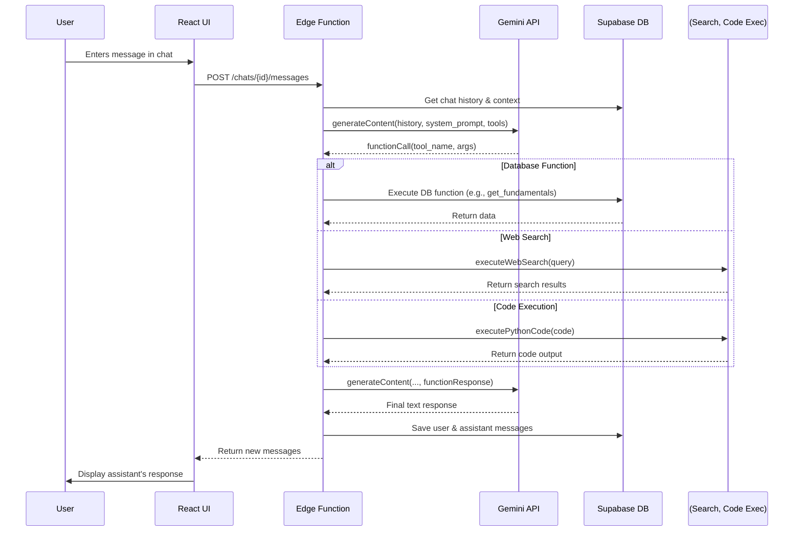

# Deep Dive: Stratos Brain Research Chat

**Date:** January 10, 2026
**Author:** Manus AI

## 1. Overview

The Research Chat is a core feature of the Stratos Brain platform, providing users with a powerful, AI-driven conversational interface for conducting in-depth analysis of financial assets. It emulates the experience of working with a human research analyst by giving the AI assistant access to a rich set of tools, including real-time database access, web search capabilities, and sandboxed code execution. This document provides a technical deep dive into the architecture, data flow, and key components that power this functionality.

## 2. Key Files

The functionality is primarily implemented across the following key files in the repository:

| File Path | Component | Description |
| :--- | :--- | :--- |
| `dashboard/client/src/pages/CompanyChat.tsx` | Frontend | The main page component that lays out the chat interface, including the list of chats and the main chat window. |
| `dashboard/client/src/components/CompanyChatInterface.tsx` | Frontend | The core UI for a single chat session, handling message display, user input, and interaction with the backend. |
| `dashboard/client/src/hooks/useCompanyChats.ts` | Frontend | A collection of React hooks for fetching chat lists, messages, and sending new messages to the backend API. |
| `dashboard/client/src/components/ThinkingSection.tsx` | Frontend | A UI component that visualizes the AI's tool usage (database queries, web searches, code execution) for transparency. |
| `supabase/functions/company-chat-api/index.ts` | Backend | The main Supabase Edge Function that serves as the backend API for the entire chat feature. |
| `supabase/migrations/013_company_chats.sql` | Database | The initial database migration that sets up the required tables (`company_chats`, `chat_messages`, etc.). |
| `supabase/migrations/014_user_specific_chats.sql` | Database | A subsequent migration that adds `user_id` to enable user-specific, private chat histories. |

## 3. Architecture and Data Flow

The Research Chat employs a classic three-tier architecture: a React frontend, a Supabase Edge Function backend, and a PostgreSQL database. The magic, however, lies in the interaction between the backend and the Gemini API, which orchestrates the use of various tools.

### 3.1. Frontend Components

The frontend is responsible for rendering the user interface and managing the client-side state.

-   **`CompanyChat.tsx`**: This page acts as the main container, displaying a list of available chats (`CompanyChatList`) and the active chat window (`CompanyChatInterface`). It manages the selection of chats and the creation of new ones.
-   **`CompanyChatInterface.tsx`**: This is where the main interaction happens. It displays the message history, provides an input box for the user, and handles the logic for sending messages. When a message is sent, it calls the `sendChatMessage` function from the `useCompanyChats` hook.
-   **`useCompanyChats.ts`**: This crucial file abstracts all communication with the backend API. It uses the `SWR` library to fetch and cache chat lists and messages. The `sendChatMessage` function makes a `POST` request to the `/api/company-chat-api/chats/:chatId/messages` endpoint.
-   **`ThinkingSection.tsx`**: A key UX component that provides transparency into the AI's process. It takes the `tool_calls`, `code_execution_result`, and `grounding_metadata` from the assistant's message and renders a collapsible section showing exactly which tools were used and what data was returned.

### 3.2. Backend Edge Function

The `company-chat-api` Edge Function is the brain of the operation. It's a single, large Deno TypeScript file that handles all API requests for the chat.

-   **Routing**: The function uses a `switch` statement on the request method and path to route requests to the appropriate logic. Key endpoints include:
    -   `GET /chats`: List all chats for the user.
    -   `POST /chats`: Create a new chat for an asset.
    -   `GET /chats/:id/messages`: Get messages for a specific chat.
    -   `POST /chats/:id/messages`: The main endpoint for sending a message and getting an AI response.
-   **Authentication**: It checks for a `x-user-id` header to isolate chat data, ensuring users can only access their own conversations.
-   **Message Handling (`POST /chats/:id/messages`)**: This is the most complex part of the backend. When a user sends a message, the function performs the following steps:
    1.  Retrieves the chat history from the database.
    2.  Constructs a detailed `systemPrompt` containing the asset's context, grounding rules, and tool usage guidelines.
    3.  Calls the Gemini API (`callGeminiWithTools`) with the history, system prompt, and a list of available function declarations.
    4.  Receives either a text response or a `functionCall` request from Gemini.
    5.  If it's a function call, it executes the requested function (e.g., queries the database, performs a web search).
    6.  It sends the function's result back to Gemini in a new API call.
    7.  Gemini uses the function result to generate a final text response.
    8.  The function saves the user's message and the assistant's final response (including all tool call data) to the database.
    9.  It returns the newly created messages to the frontend.

### 3.3. Database Schema

The database schema, defined in `013_company_chats.sql`, is designed to store all aspects of the chat conversations.

| Table | Description |
| :--- | :--- |
| `company_chats` | Stores a chat session for a specific asset and user. Links to `auth.users` via `user_id`. |
| `chat_messages` | Contains every message in a chat, including the role (`user`, `assistant`), content, and crucially, the `tool_calls` JSONB field. |
| `chat_tool_executions` | A detailed audit log for every tool execution, storing the input, output, and status. |
| `chat_context_snapshots` | Caches periodic snapshots of an asset's data to be injected into the system prompt. |

## 4. Core Feature: AI Function Calling

The most powerful aspect of the Research Chat is its use of **unified function calling** with the Gemini API. This allows the AI to decide when and how to use external tools to answer a user's query.

1.  **Declaration**: A list of available tools (`unifiedFunctionDeclarations`) is defined in the Edge Function. This list includes functions for database access (`get_asset_fundamentals`, `get_price_history`), web search (`web_search`), and code execution (`execute_python`). Each declaration describes what the function does and the parameters it accepts.

2.  **Orchestration Loop**: The `callGeminiWithTools` function implements a loop. The AI can request multiple function calls in a single turn. The backend executes these calls, collects the results, and sends them back to the AI. This loop continues until the AI has enough information to generate a final text response to the user.

3.  **Execution**: The backend contains the actual implementation for each declared function. For example, `executeFunctionCall` will route a `get_asset_fundamentals` call to a Supabase database query, while a `web_search` call is routed to the Google Custom Search API.

4.  **Transparency**: The results of these function calls are not hidden. They are stored in the `tool_calls` and `code_execution_result` fields of the `chat_messages` table and are explicitly displayed to the user in the `ThinkingSection` component, providing full transparency into the AI's reasoning process.

## 5. Conclusion

The Stratos Brain Research Chat is a well-engineered and highly capable feature. It successfully combines a modern web stack with the power of LLM function calling to create a tool that is both powerful for users and transparent in its operation. The architecture is robust, scalable, and provides a solid foundation for future enhancements.
